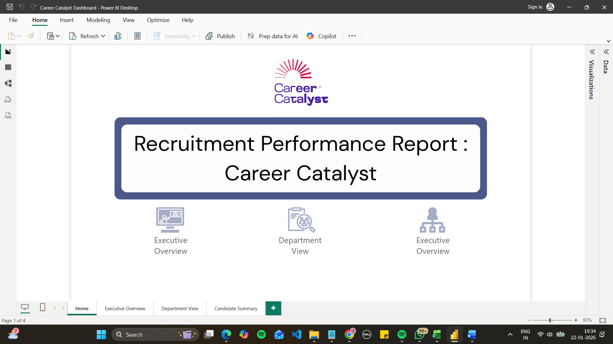
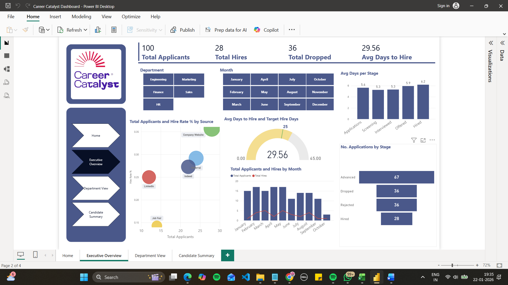
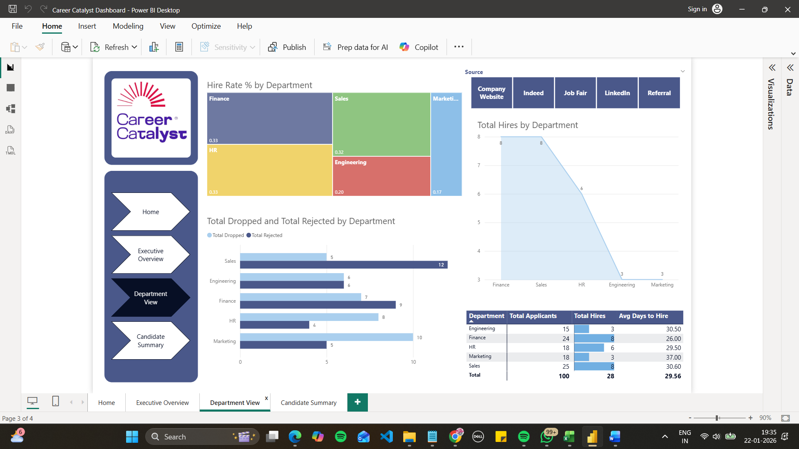
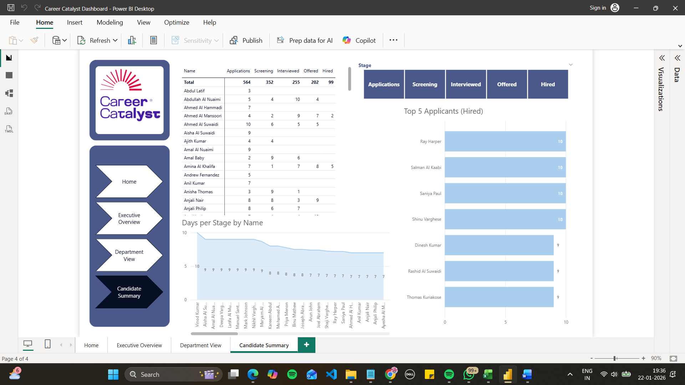

# Career-Catalyst-Recruitment-Analysis
Recruitment performance dashboard analyzing hiring funnels, source effectiveness, and departmental hiring trends for Career Catalyst, UAE.

# Career Catalyst | Recruitment Performance Report

## 📌 Project Overview
This project provides a comprehensive analysis of the recruitment lifecycle for Career Catalyst, UAE. It tracks 100 total applicants through a multi-stage hiring funnel to identify bottlenecks, evaluate sourcing strategies, and measure departmental hiring efficiency.

## 🛠️ Tech Stack
* **Tool:** Power BI
* **Key Metrics:** Hire Rate %, Avg Days to Hire, Funnel Conversion, Source Effectiveness.
* **Visualizations:** Funnel charts, correlation bubble charts, and time-series applicant tracking.

## 📊 Key Insights (Data-Driven)
* **Funnel Bottleneck:** Identified a significant 53% drop-off between the "Offered" and "Hired" stages, indicating a loss of over half of qualified talent at the final stage.
* **Source Quality:** While Job Fairs bring in volume, the Company Website produces the highest quality of hires with a 21% conversion rate.
* **Efficiency:** The average time to hire is 29.56 days, with the longest delays occurring during administrative post-offer phases (nearly 12 days).
* **Departmental Trends:** The Marketing department shows the lowest conversion rate at 5.5%.

## 💡 Strategic Recommendations
1. **Offer-to-Hire Optimization:** Investigate the high rejection rate of offers (50%) to determine if compensation or competing offers are the primary drivers.
2. **Process Automation:** Implement digital signatures and automated background checks to reduce the 12-day administrative delay after an offer is accepted.
3. **Sourcing Strategy:** Reallocate budget from costly Job Fairs to optimizing the LinkedIn presence and Careers website, which yield higher quality candidates.
4. **Role Alignment:** Review job descriptions for departments with high rejection rates to ensure candidate expectations align with role realities.

## 📷 Dashboard Previews

### Home Page

### Executive Overview

### Department View

### Candidate Summary

